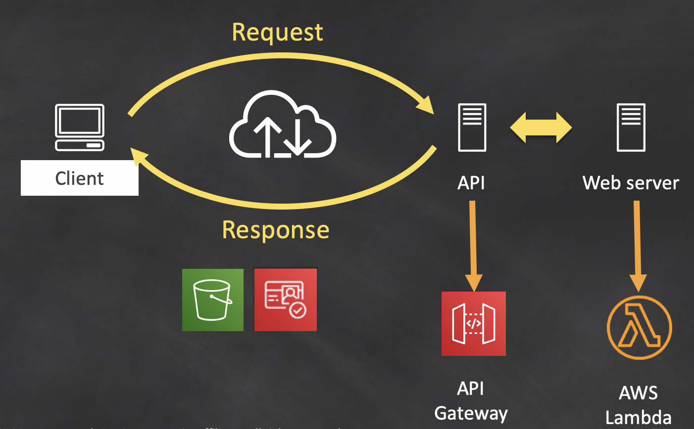
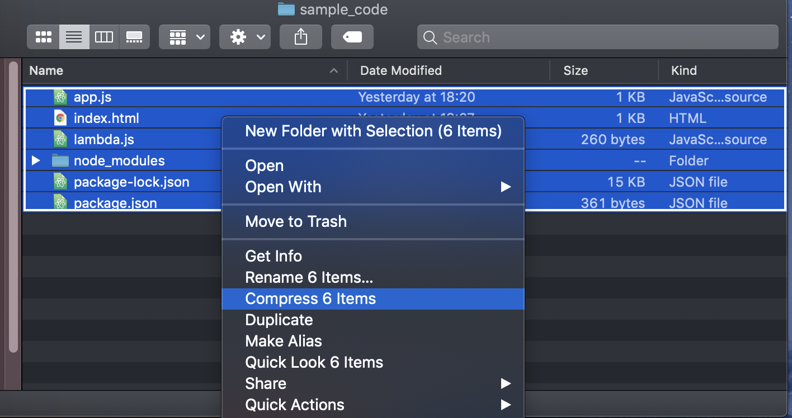
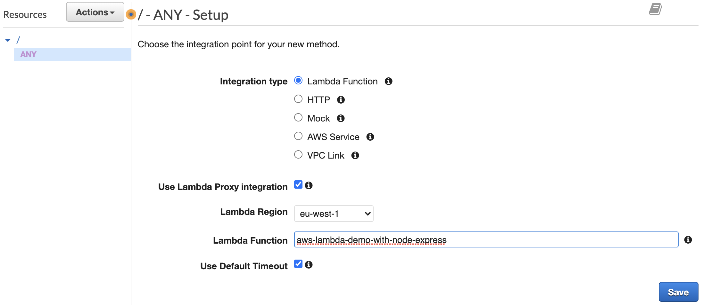
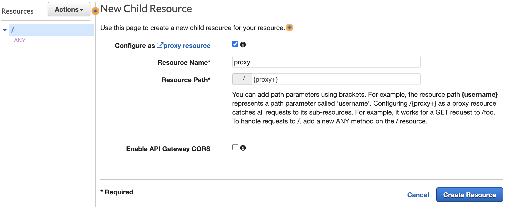
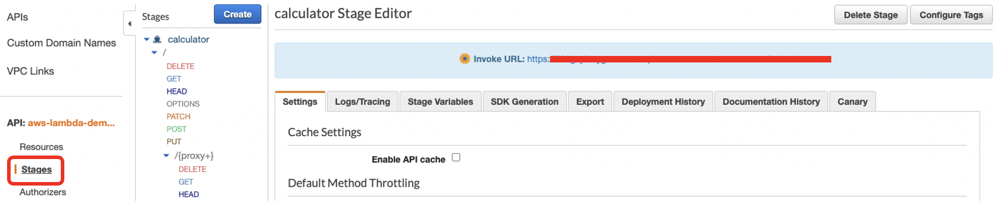

# How to Deploy a Node-Express App on AWS Lambda

The purpose of this repository is to demonstrate how to deploy a simple web
application built by Express - Node.js web application framework on AWS Lambda.

### Requirements
  - `Node.js with Node Package Manager(npm)` should be installed on your local system.

### Architecture

**Request Response Cycle :**

  

### Prepare the code

 - Download the `sample_code` directory to your local system.

 - Run `npm install` command in the same directory of the downladed folder. `package.json` file includes necessary dependencies to generate `node_modules/`

 - Create a zip file that will include all files in the directory.

 **Note:** Don't zip the folder itself, but select all files individually. Refer to below image if needed:

       

###  Create a Lambda function

- Give your function a name like "aws-lambda-demo-with-node-express". Basic permissions will be sufficient for the purpose of this demonstration

- Upload zip file created on previous step through the console and click DEPLOY

- Rename your handler as "lambda.handler". It is the main module that uses [`aws-serverless-express`](https://github.com/awslabs/aws-serverless-express) package to easily get the event object Lambda receives from API Gateway

###  Integration with API Gateway  

- Create a new REST API and name it "aws-lambda-demo-with-node-express"

- Create a method with ANY, use Lambda Proxy integration and select your function. Refer to below image if needed:

       

- Create a resource, configure as proxy resource. Refer to below image if needed:

       

- Use Lambda Function Proxy and select your function.

- Deploy your API and name the stage "calculator".

 **Note:** This will be URL extension for our API, which needs to match with the html form inside our code.

 `<form class="" action="/calculator" method="post">`

- Now you can **[Invoke URL]** provided by
Amazon API Gateway. You can find this on Stages column of the console.

       

## Security

See [CONTRIBUTING](CONTRIBUTING.md#security-issue-notifications) for more information.

## License

This library is licensed under the MIT-0 License. See the LICENSE file.
